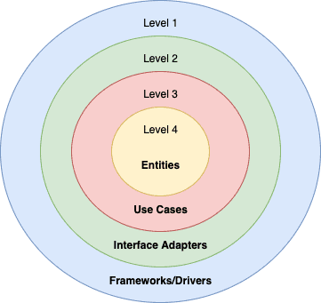
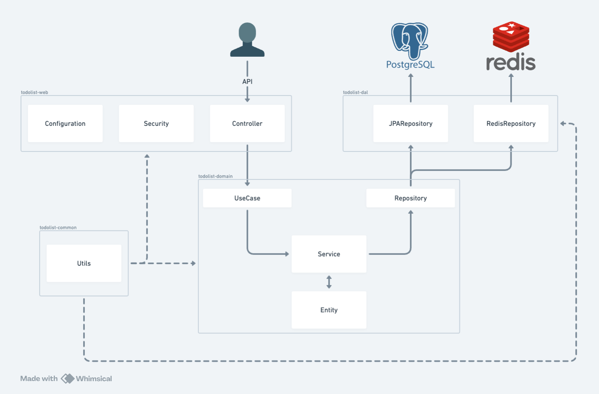

# Todolist - Server side

이 프로젝트는 투두리스트의 서버 사이드 앱입니다. 
이 애플리케이션은 사용자가 할 일을 관리하고, 할 일을 추가하고, 완료한 할 일을 체크하는 등의 기능을 제공합니다.

## Dependency

- Java 21
- Gradle 8.5.1
- Spring Boot 3.2.4
  - Spring Data JPA
  - Spring Data Redis
  - Spring Security

## Features
- [X] 로그인 기능
- [ ] oauth 기능

## Architecture

클린아키텍쳐에 완벽히 부합하는 구조는 아니지만
핵심 엔티티에서 의존성을 확장해나가는 방향을 동일하게 가져가도록 합니다.
아래 모듈에서 의존성에 대해 설명합니다.

## Module

### todolist-domain
핵심 엔티티와 비즈니스 로직이 포함된 구조입니다.
각 중요한 도메인별로 엔티티와 유스케이스, 유스케이스를 구현한 서비스 로직을 가지고있습니다.
실제로 순수하게 떨어져나가도 작동하는 자바 코드를 원하지만 실용성을 위해 스프링 어노테이션에 의존합니다.
#### domain
비즈니스 로직을 위한 엔티티를 포함합니다.
#### repository
데이터 엑세스 레이어와 연결될 인터페이스입니다. 비즈니스 로직에서 필요한 인터페이스를 정의합니다.
#### use-case
외부에서 들어오는 요청을 처리하는 인터페이스입니다. 실제 비즈니스 로직이 작동하는 유즈 케이스를 구현합니다.
#### service
유즈케이스 인터페이스를 구현합니다. 실제 비즈니스 로직이 들어갑니다.

### todolist-dal
데이터 엑세스 레이어입니다. 외부 데이터베이스에 관한 설정과 구현을 담고있습니다. 
도메인모듈의 레포지토리의 실제 구현체를 가집니다.

### todolist-web
스프링의 설정과 외부 API인터페이스를 담당합니다. 시큐리티 설정도 여기서 담당합니다.

### todolist-common
모든 모듈에 의존할 수 있습니다. 
최대한 순수하게 분리될 수 있는 유틸들만 위치하도록 합니다.
